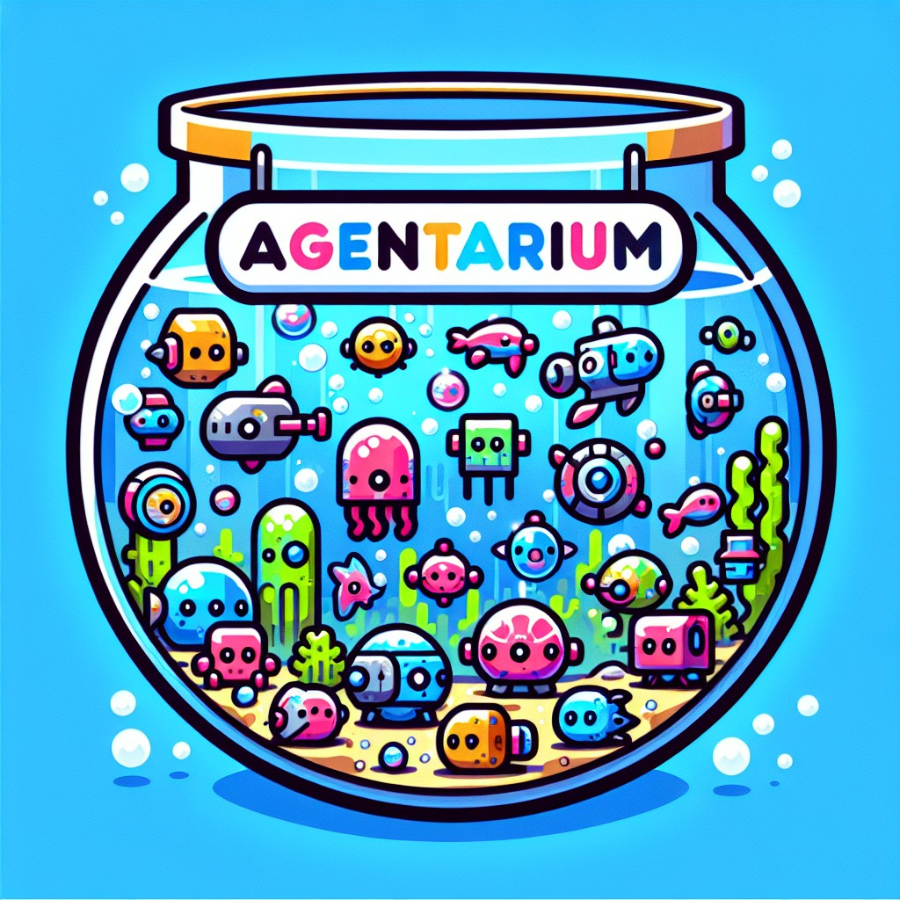

# Agentarium

<p align="center">
  
</p>

**A curated space for agent experiments and demos**

A production-ready multi-agent AI application showcasing intelligent agent patterns with real-time streaming, comprehensive tool integration, and agent-to-agent communication. Built on Azure with Microsoft's Agent Framework, featuring a React TypeScript frontend and FastAPI backend.

## ✨ Features

- **🤖 Multi-Agent Orchestration**: Handoff router pattern with specialized agents for support triage, sales, and Azure operations
- **⚡ Real-Time Streaming**: Server-Sent Events (SSE) for live agent responses with tool execution tracing
- **🔧 Extensible Tool Integration**:
  - Model Context Protocol (MCP) servers for Azure resources
  - Custom MSSQL MCP tool integration (see [adventure-mcp](https://github.com/MaxBush6299/adventure-mcp))
  - OpenAPI specification support
  - Agent-to-Agent (A2A) protocol for inter-agent communication
- **📊 Trace Visualization**: Real-time view of tool calls, inputs, and outputs during agent execution
- **🎨 Modern UI**: React TypeScript with Fluent UI components and MSAL authentication
- **☁️ Azure Native**: Deployed on Azure Container Apps with Cosmos DB, Application Insights, and Key Vault

## 🏗️ Architecture

### Frontend (`/frontend`)
React TypeScript application with:
- **Chat Interface**: Interactive conversation with agents, streaming responses
- **Agent Management**: Browse available agents and their capabilities
- **Trace Panel**: Real-time visualization of tool execution (inputs, outputs, timing)
- **Authentication**: Azure Entra ID (MSAL) integration
- **Tech Stack**: Vite, React Router, Fluent UI v9, react-markdown

### Backend (`/backend`)
FastAPI application powered by Microsoft Agent Framework:
- **Agent Factory**: Dynamic agent creation from Cosmos DB metadata
- **Handoff Router**: Orchestrates conversations between specialized agents
- **Tool Registry**: Extensible system for MCP, OpenAPI, and A2A tools
- **Streaming API**: SSE endpoints for real-time responses with trace events
- **Persistence**: Cosmos DB for agent configurations and chat history
- **Tech Stack**: FastAPI, Azure SDK, semantic-kernel patterns

### Infrastructure (`/infra`)
Azure Bicep templates for complete infrastructure:
- **Container Apps**: Scalable hosting for frontend, backend, and MCP sidecar
- **Cosmos DB**: NoSQL database for agent metadata and conversations
- **Application Insights**: Distributed tracing and telemetry
- **Key Vault**: Secure storage for API keys and connection strings
- **Container Registry**: Private registry for Docker images

## 🚀 Getting Started

### Prerequisites
- **Azure Subscription**: For deploying infrastructure
- **Azure OpenAI**: Deployed models (GPT-4, GPT-4o recommended)
- **Local Development**:
  - Python 3.11+
  - Node.js 20+
  - Docker & Docker Compose
  - Azure CLI

### Quick Start

1. **Clone the repository**
   ```bash
   git clone https://github.com/MaxBush6299/agentarium.git
   cd agentarium
   ```

2. **Deploy Azure Infrastructure**
   ```bash
   az login
   cd infra
   
   # Create resource group
   az group create --name rg-agentarium-dev --location westus
   
   # Deploy infrastructure
   az deployment group create \
     --resource-group rg-agentarium-dev \
     --template-file main.bicep \
     --parameters @parameters/dev.bicepparam
   ```

3. **Configure Backend**
   ```bash
   cd ../backend
   
   # Copy environment template
   cp .env.template .env
   
   # Edit .env with your Azure resources:
   # - AZURE_OPENAI_ENDPOINT
   # - AZURE_OPENAI_API_KEY
   # - COSMOS_DB_ENDPOINT
   # - COSMOS_DB_KEY
   ```

4. **Run Backend Locally**
   ```bash
   # Install dependencies
   pip install -r requirements.txt
   
   # Start server
   cd src
   python -m uvicorn main:app --reload
   ```

5. **Run Frontend Locally**
   ```bash
   cd ../frontend
   
   # Install dependencies
   npm install
   
   # Configure environment
   cp .env.template .env.local
   # Edit .env.local with your backend URL and Entra ID settings
   
   # Start development server
   npm run dev
   ```

6. **Access Application**
   - Frontend: http://localhost:5173
   - Backend API: http://localhost:8000
   - API Docs: http://localhost:8000/docs

### Docker Compose (Alternative)

Run both frontend and backend with Docker:

```bash
docker-compose up --build
```

## 🔧 Creating Custom MCP Tools

Agentarium supports Model Context Protocol (MCP) servers for extending agent capabilities. See the **[adventure-mcp](https://github.com/MaxBush6299/adventure-mcp)** repository for a complete example of building a custom MSSQL MCP tool.

### Example: MSSQL MCP Tool

The adventure-mcp project demonstrates:
- MCP server implementation for SQL Server database access
- OAuth authentication with Azure Entra ID
- Tool schema definitions for database queries
- Integration with Agent Framework

To add your own MCP tool:

1. **Create MCP Server** (see adventure-mcp for template)
2. **Register in `backend/src/tools/mcp_tools.py`**:
   ```python
   mcp_client = MCPClient(
       server_path="node",
       server_args=["/path/to/your-mcp-server/server.js"],
       config_path="/path/to/config.json"
   )
   ```
3. **Add to Agent Configuration** in Cosmos DB or via API

## 🤝 How Agent Framework is Used

This project is built on [Microsoft Agent Framework](https://github.com/microsoft/semantic-kernel), providing:

- **ChatAgent Base**: All agents inherit from `agent_framework.ChatAgent`
- **Tool Composition**: Specialist agents converted to tools via `.as_tool()` for router composition
- **Thread Management**: Agent threads maintain conversation context across handoffs
- **Function Calling**: Framework handles tool invocation, result extraction, and message history

**Key Integration Points:**
- `backend/src/agents/factory.py` - Dynamic agent instantiation from metadata
- `backend/src/agents/handoff_router.py` - Multi-agent orchestration with thread management
- `backend/src/tools/` - MCP, OpenAPI, and A2A tool adapters
- `backend/src/api/chat.py` - Streaming responses with trace extraction from framework messages

## 📁 Project Structure

## 📁 Project Structure

```
agentarium/
├── frontend/                    # React TypeScript UI
│   ├── src/
│   │   ├── components/         # React components (chat, agents, trace panel)
│   │   ├── pages/             # Page components (home, chat, agents)
│   │   ├── services/          # API client and utilities
│   │   └── config.ts          # Frontend configuration
│   ├── Dockerfile
│   └── package.json
│
├── backend/                     # FastAPI application
│   ├── src/
│   │   ├── agents/            # Agent implementations and factory
│   │   ├── tools/             # MCP, OpenAPI, A2A tool integrations
│   │   ├── api/               # REST API endpoints
│   │   ├── persistence/       # Cosmos DB repositories
│   │   ├── a2a/               # Agent-to-Agent protocol
│   │   └── main.py            # Application entry point
│   ├── Dockerfile
│   └── requirements.txt
│
├── mcp-server/                  # Azure MCP server sidecar
│   ├── server.js              # MCP server implementation
│   ├── config/                # Server configurations
│   └── Dockerfile
│
├── infra/                       # Azure Bicep templates
│   ├── main.bicep             # Main infrastructure template
│   ├── modules/               # Reusable Bicep modules
│   │   ├── container-apps.bicep
│   │   ├── cosmos-db.bicep
│   │   ├── key-vault.bicep
│   │   └── observability.bicep
│   └── parameters/            # Environment-specific parameters
│
└── images/                      # Logo and favicon assets
```

## � Key Technologies

| Component | Technologies |
|-----------|-------------|
| **Frontend** | React 18, TypeScript, Vite, Fluent UI v9, React Router, MSAL |
| **Backend** | Python 3.11, FastAPI, Azure SDK, Microsoft Agent Framework |
| **Database** | Azure Cosmos DB (NoSQL) |
| **AI/ML** | Azure OpenAI (GPT-4, GPT-4o), semantic-kernel patterns |
| **Infrastructure** | Azure Container Apps, Application Insights, Key Vault, ACR |
| **DevOps** | Docker, Azure CLI, GitHub Actions (optional) |

## 🧪 Sample Agents

Agentarium includes several pre-configured agents:

### 🎯 Handoff Router Agent
- **Purpose**: Orchestrates conversations and routes to specialist agents
- **Tools**: All specialist agents (as tools), web search, general utilities
- **Model**: GPT-4o

### � Support Triage Agent
- **Purpose**: Analyzes support tickets and routes to appropriate teams
- **Tools**: Ticket system API, knowledge base search
- **Model**: GPT-4

### 💰 Sales Agent
- **Purpose**: Provides product information and sales data
- **Tools**: MSSQL MCP tool (via adventure-mcp), product catalog API
- **Model**: GPT-4

### ☁️ Azure Operations Agent
- **Purpose**: Manages Azure resources and provides operational insights
- **Tools**: Azure MCP server (App Services, VMs, Cosmos DB, Storage)
- **Model**: GPT-4o

## 🎨 Screenshots & Demo

*(Add screenshots of your chat interface, trace panel, and agent management UI here)*

## 📚 Additional Resources

- **Development Documentation**: See `/dev-docs` for architecture decisions and implementation details
- **Custom MCP Tools**: [adventure-mcp repository](https://github.com/MaxBush6299/adventure-mcp)
- **Microsoft Agent Framework**: [GitHub repository](https://github.com/microsoft/semantic-kernel)
- **Azure OpenAI**: [Service documentation](https://learn.microsoft.com/azure/ai-services/openai/)

## 🤝 Contributing

Contributions are welcome! Please:

1. Fork the repository
2. Create a feature branch (`git checkout -b feature/amazing-feature`)
3. Commit your changes (`git commit -m 'feat: add amazing feature'`)
4. Push to the branch (`git push origin feature/amazing-feature`)
5. Open a Pull Request

## 📝 License

This project is available under the MIT License. See LICENSE file for details.

## 🙏 Acknowledgments

- **Microsoft Agent Framework** for the agent runtime and patterns
- **Azure OpenAI** for LLM capabilities
- **Fluent UI** for the component library
- Community contributors and testers

---

**Live Demo**: *(Add your deployed URL here)*  
**Repository**: https://github.com/MaxBush6299/agentarium  
**Questions?** Open an issue or check `/dev-docs` for detailed documentation
